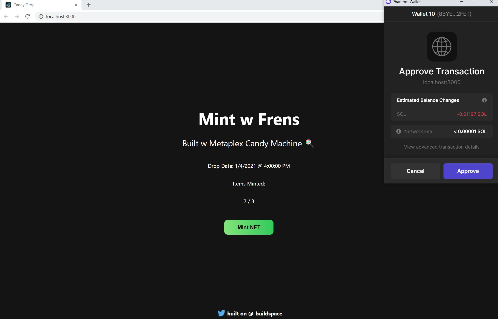
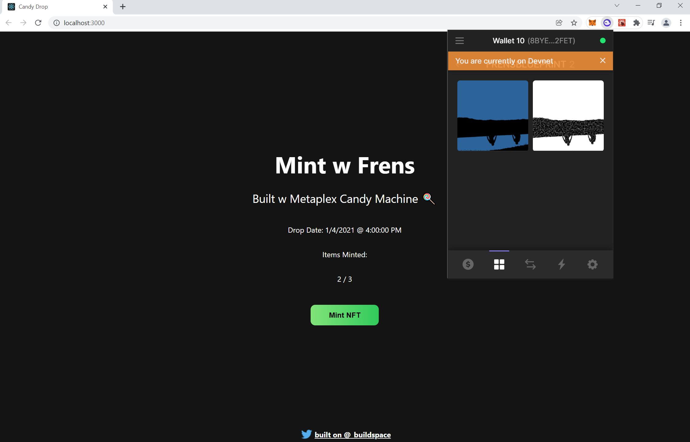

<h2>Description:</h2>
NFT Drop Starter Project - built on Solana using the Metaplex Candy Machine. The web app lets users connect their wallet, click the mint button and receive an NFT from our sample collection in their Phantom wallet. Thank you buildspace!

Candy Machine deployed on Solana devnet:

https://explorer.solana.com/address/GBm8d4oWqTcXv2UnYeMtbW7GWuuHQKLGBEZ59BdJkeRi?cluster=devnet

Web App deployed with Vercel:

https://nft-drop-starter-project-pi-eight.vercel.app/ 

A few notes from the buildspace lesson:

Metaplex - 
Metaplex is the NFT standard on Solana and has created a set of standardized tools and libraries to create NFTs. On Ethereum, you need to create a custom OpenZeppelin ERC-721 contract and deploy it in order to create NFTs. Then in order to mint an NFT, you call the mint function on that custom contract. With Metaplex, you don't need to write your own contract - or "program" on Solana. Metaplex has already deployed its own standard NFT contracts that any developer can interact with and build their own NFT collections on. 

Candy Machine - 
A candy machine is what Metaplex calls a basic NFT drop where users can connect their wallet, click mint and get an NFT. A candy machine will not accept a user's funds if there are no more NFTs left to sell. NFTs were uploaded to Arweave - a decentralized file-store - prior to initializing this candy machine. 

<h2>Demo:</h2>

Mint Transaction:

NFTs in Wallet:

